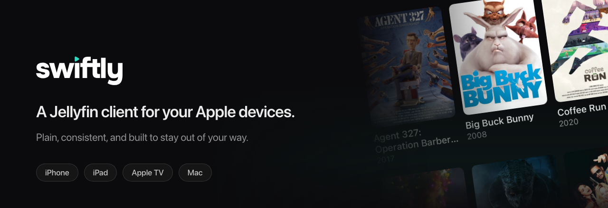
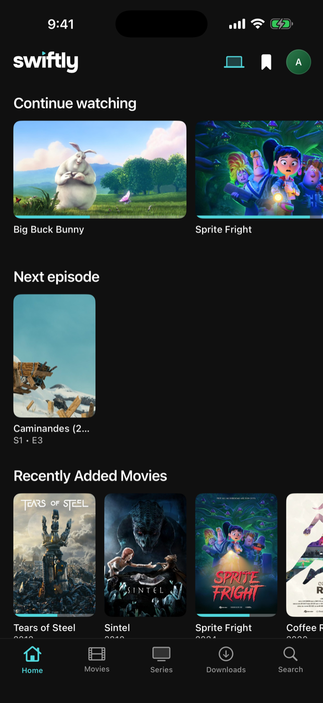
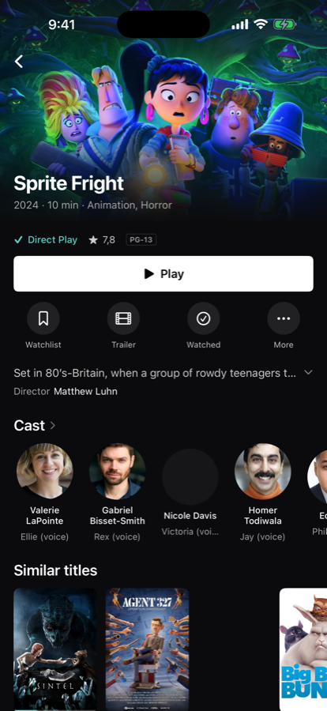
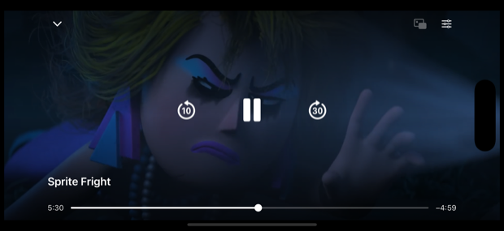

<div align="center">



<br>

[](#status)
[](LICENSE)
[](https://jellyfin.org)

</div>

<br>

**Swiftly is a Jellyfin client for Apple devices. It is meant to be plain, and
to just work.**

There is no long feature list here, and that is deliberate. It opens, it finds
your library, it plays. Resume where you stopped, subtitles, Picture in
Picture — the ordinary things, done properly, instead of a hundred switches
nobody ever touches.

Underneath, it works hard not to make your server transcode, so the picture
stays untouched and your CPU stays cool. You should never have to think about
that, which is rather the point.

<br>

## Screenshots

<table>
<tr>
<td width="25%"></td>
<td width="25%"></td>
<td width="25%"></td>
<td width="25%"></td>
</tr>
<tr>
<td align="center"><sub>Home</sub></td>
<td align="center"><sub>Detail</sub></td>
<td align="center"><sub>Player</sub></td>
<td align="center"><sub>Picture in Picture</sub></td>
</tr>
</table>

<br>

## Status

| Platform | State |
|---|---|
| iPhone | Version 1.0.0 in review with Apple |
| iPad | In development |
| Apple TV | In development, beta planned next |
| Mac | In development |

One app, one design, sized for the screen you are on. The logic — server
access, device profile, playback timing — is shared; only the views differ,
and only where distance, input or window size demand it.

<br>

## What it does

- **Direct Play and Direct Stream** for every codec the hardware can handle.
  The device profile declares containers, codecs and every subtitle format, so
  the server has no reason to re-encode. Undeclared subtitles are the most
  common cause of a needless transcode, and they are all declared here.
- **Picture in Picture** on iPhone and iPad.
- **Resume** where you stopped, with the next episode following on its own.
- **Quick Connect**, so you never type a password on a television remote.
- **No account, no subscription, no ads, no tracking.** Nothing leaves your
  device except the requests to the server you enter yourself.

<br>

## Requirements

- Your own Jellyfin server, **10.10 or newer**. Swiftly hosts nothing and has
  no account of its own — you sign in with the credentials you already have.
- iOS 18, tvOS 18 or macOS 15.

<br>

## Building

```bash
git clone https://github.com/paulherter/swiftly-for-jellyfin.git
cd swiftly-for-jellyfin

# VLCKit is 2.7 GB and not in this repository.
# NOTE: this fetches VideoLAN's official build, which has a known bug —
# seeking inside MKV files served over HTTP reads from the start of the
# file. The fix is in Werkzeuge/vlckit-patches/ and must be applied to a
# VLCKit build for seeking to work. See "Known issue: VLCKit" below.
Werkzeuge/vlckit-holen.sh

# The .xcodeproj is generated, not checked in.
brew install xcodegen && xcodegen generate

export DEVELOPER_DIR=/Applications/Xcode.app/Contents/Developer
xcodebuild -project Swiftly.xcodeproj -scheme Swiftly-iOS \
  -destination 'platform=iOS Simulator,name=iPhone 17 Pro' build
```

Logic lives in `Packages/JellyfinKit` and is testable without a simulator:

```bash
cd Packages/JellyfinKit && swift test
```

The Jellyfin OpenAPI description is not included; fetch it from any server at
`/openapi.json` if you need it.

<br>

## Known issue: VLCKit

VLC 4 discards the seek index of Matroska files served over HTTP: every seek
reads from the beginning of the file and takes 30 to 90 seconds. VLC 3 does
not have this restriction, which is why other clients seek instantly.

The two-line fix lives in `Werkzeuge/vlckit-patches/` with a README of its
own. Swiftly ships a VLCKit built with that patch applied; the official
build fetched by `vlckit-holen.sh` does not have it. The patch has been
submitted upstream so that official builds can be used again.

## Reporting bugs

The Discord is the fastest way: **https://discord.gg/mzKPMEr7hj**

The single most useful report is one where the server transcoded when it
should not have. If your Jellyfin dashboard says *Transcoding* instead of
*Direct Play* or *Direct Stream*, please include the container, video codec,
audio codec and subtitle format of that file.

<br>

## Built with Claude

Swiftly was written together with Anthropic's Claude, and the commit history
says so — every commit carries a `Co-Authored-By` line. The decisions, the
testing and the responsibility are mine; a good deal of the typing was not.
It seemed more honest to say that here than to let someone work it out.

<br>

## License

The code is licensed under the **Mozilla Public License 2.0** — see
[LICENSE](LICENSE). In short: you may use, change and redistribute it, and if
you change these files you publish your changes too.

**The name and the artwork are not covered by that license.** "Swiftly", the
wordmark and the app icon remain the author's. You are welcome to fork the
code; please do not ship the result under this name or with this icon.

### VLCKit

Playback uses [VLCKit](https://code.videolan.org/videolan/VLCKit), which is
licensed under the **LGPL-2.1-or-later**. It is not distributed in this
repository; `Werkzeuge/vlckit-holen.sh` fetches VideoLAN's official build and
verifies its SHA-256. The full source of this application is published here
precisely so that anyone can rebuild it against their own build of that
library.

### Sample content

The screenshots show films by the [Blender
Foundation](https://studio.blender.org/films/) — *Big Buck Bunny*, *Sintel*,
*Agent 327*, *Sprite Fright* and others — released under Creative Commons
Attribution.
