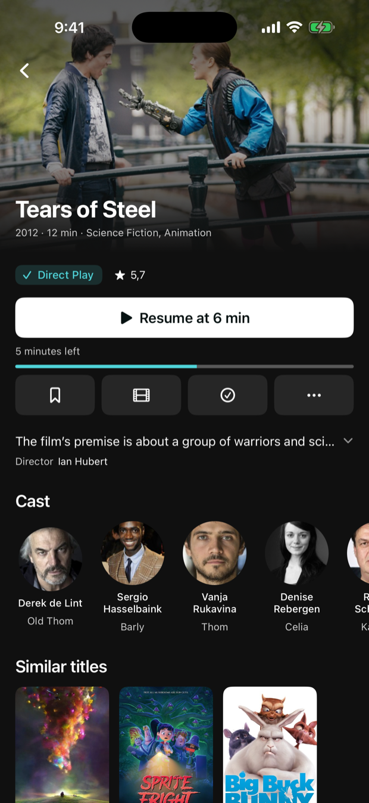
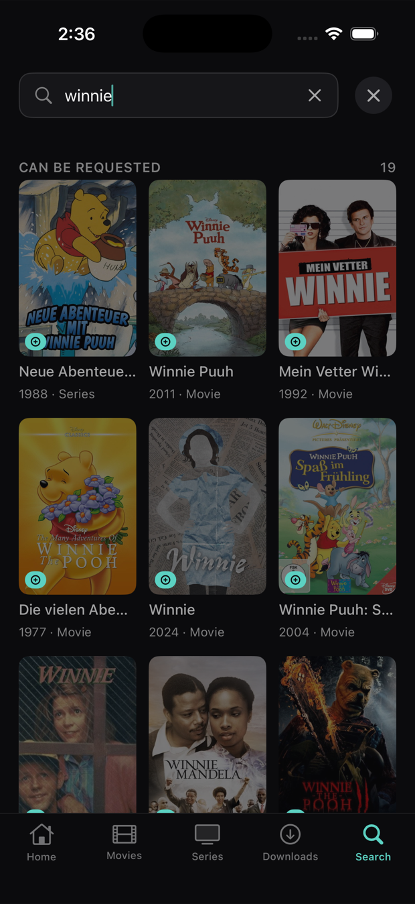

<div align="center">


# Swiftly Player

**A native Jellyfin client for iPhone, iPad, Apple TV, Mac, Android, Android TV, Linux and Windows.**
It never transcodes — every file plays as Direct Play or Direct Stream.

<br>

[](#-platforms)
&nbsp;
[](LICENSE)
&nbsp;
[](https://jellyfin.org)
&nbsp;
[](https://swiftlyplayer.com)

<br>

[](https://apps.apple.com/app/id6806824067)
&nbsp;
[](https://testflight.apple.com/join/MqeP2cnj)
&nbsp;
[](#-android)
&nbsp;
[](#-windows)
&nbsp;
[](#-linux)
&nbsp;
[](https://discord.gg/MeGwfv3UwN)

<br>

</div>

<br>

**Swiftly Player is a client for your own Jellyfin server. It is meant to
be plain, and to just work.**

It opens, it finds your library, it plays. Most of it is the ordinary things
done properly, instead of a hundred switches nobody ever touches — and
underneath, it works hard **never to make your server transcode**, so the
picture stays untouched and your CPU stays cool.

If you came here looking for a **Jellyfin app for iPhone or iPad**, a
**Jellyfin client for Apple TV**, a **native Jellyfin player for macOS**, a
**Jellyfin app for Android or Android TV**, or a
**Jellyfin desktop client for Linux or Windows** — that is all one app, and
this is it. Picture in Picture, Direct Play without transcoding, several
accounts on one server, and handing a running film from one device to the
next.

But three things it does that no other Jellyfin client does at all.

<br>

## 📸 Screenshots

<table>
<tr>
<td width="25%"></td>
<td width="25%"></td>
<td width="25%"></td>
<td width="25%"></td>
</tr>
<tr>
<td align="center"><sub>Home</sub></td>
<td align="center"><sub>Detail</sub></td>
<td align="center"><sub>Requests</sub></td>
<td align="center"><sub>Picture in Picture</sub></td>
</tr>
</table>


<sub>The player, landscape.</sub>

<br>

## ✨ Three things you will not find elsewhere

### 📲 Continue on this device

You are watching on the Apple TV. You get up, take your phone — and there is a
badge next to your profile picture. **Tap it, and the film carries on here,
from the same second.** The television stops on its own; you do not pause
anything, you do not scroll to find where you were.

It works in every direction: TV to phone, phone to Mac, Mac to TV — Android
phones included. If two of
your devices are playing, Swiftly asks which one you meant. Only your own
account is offered, and only devices that are actually reachable.

I have not seen this in another Jellyfin client, and it is the thing people
notice on day one and then cannot do without.

### 👥 Several Jellyfin accounts on one server

Your household has one server and several accounts on it — yours, your
partner's, the children's. Swiftly holds **all of them at once**.

Above "Sign out" there is "Add another account". After that, a strip at the
top of your profile switches between them: press a picture, and you are in
that account. **No password, no signing out, no waiting** — both logins stay
in the keychain, and Continue Watching, Next Up and everything else changes
with them.

Signing out affects only the account you are on. The others stay.

### 📺 Every Apple TV profile keeps its own login

The Apple TV already knows who is watching — it has profiles at the top of the
screen. Swiftly follows them.

**Switch the tvOS profile, and Swiftly is in that person's Jellyfin account.**
Their Continue Watching, their watched marks, their Top Shelf on the home
screen. Nobody has to sign anything in or out; the television already asked
the question, and the app simply respects the answer.

<br>

## 🌟 Everything else

### 🎬 Watching

- **Never transcode.** The device profile declares containers, codecs and
  *every* subtitle format, so the server has no reason to re-encode.
  Undeclared subtitles are the most common cause of a needless transcode, and
  they are all declared here.
- **Resume** exactly where you stopped, with the next episode following on its
  own.
- **Skip intro and recap** where your server knows about them — the button
  changes what it says, instead of appearing out of nowhere.
- **Audio and subtitle tracks** switch while the film keeps running.
- **Playback speed**, and the position is reported back to the server as you
  watch.

### 📚 Finding things

- **Several libraries** of the same kind, and the app remembers which one you
  were in.
- **Search** across your libraries, with the season and episode you meant.
- **Top Shelf**<sup>1</sup>: what you were watching sits above the app icon on
  the Apple TV home screen, before you even open it.

### 📱 On your devices

- **Picture in Picture**<sup>2</sup> — the one thing that sent me looking for
  another client in the first place.
- **Lock screen and Control Centre**<sup>2</sup> show the artwork and the
  controls.
- **Media keys**<sup>3</sup> work, and a small window stays on top while you
  do something else.
- **Quick Connect**, so you never type a password on a television remote.

### 🔒 Yours

- **No account, no subscription, no ads, no tracking.** Nothing leaves your
  device except the requests to the server you enter yourself.
- **Free and open source**, MPL-2.0.

<sub>1 Apple TV · 2 iPhone, iPad, Android · 3 Linux, Windows, Mac</sub>

<br>

## 📱 Platforms

One app, one design, sized for the screen you are on. The logic — server
access, device profile, playback timing — is shared; only the views differ,
and only where distance, input or window size demand it.

| Platform | State |
|---|---|
| 📱 iPhone | **1.0.2** on the App Store · next build on TestFlight |
| 📲 iPad | **1.0.2** on the App Store · ships with the iPhone app |
| 📺 Apple TV | **1.0.2** on the App Store |
| 💻 Mac | **1.0.2** on the App Store |
| 🤖 Android | **1.0.3** beta on Google Play · [join](#-android) |
| 📺 Android TV | **1.0.3** beta on Google Play · same app, [join](#-android) |
| 🐧 Linux | **1.0.2** · [install](#-linux) |
| 🪟 Windows | **1.0.2** · [download](#-windows) |

**One download covers iPhone, iPad, Mac and Apple TV:**
[App Store](https://apps.apple.com/app/id6806824067).

**The beta runs alongside it.** [Join on TestFlight](https://testflight.apple.com/join/MqeP2cnj)
— the next build lands there first, one link for all four. What each build
wants tested is written in its release notes, and it is usually five specific
things rather than "have a look around".

<br>

## 🤖 Android

**The Android app is in beta on Google Play**, for phones and Android TV with
Android 9 or newer. On the phone it is the same app as on the iPhone: Direct Play through libVLC,
downloads for offline viewing, continue on this device, several accounts,
Seerr requests, skip intro, Picture in Picture and Quick Connect.

Joining takes about two minutes. **Use the same Google account for every
step** — the one signed in to the Play Store on your phone.

1. **Join the tester group** —
   [groups.google.com/g/swiftly-beta](https://groups.google.com/g/swiftly-beta),
   then *Join group*. You will not receive any emails.
2. **Become a tester** —
   [play.google.com/apps/testing/de.paulherter.swiftly](https://play.google.com/apps/testing/de.paulherter.swiftly),
   then *Become a tester*.
3. **Install** — *Download it on Google Play* on that same page, or search for
   Swiftly Player in the Play Store — on your phone or on your TV.

<details>
<summary>The app does not show up</summary>

- It can take up to 15 minutes after step 2 before the Play Store lists it.
- *Item not found* almost always means a different Google account. Tap your
  profile picture in the Play Store, check which account it uses, and repeat
  steps 1 and 2 with that one.
- Several Google accounts on the phone: open both links in a browser where only
  that account is signed in.

</details>

**Why joining now helps.** Google lets a new app go public only after at least
12 testers have been in its test for 14 days. Every tester counts towards that.
Updates arrive through the Play Store like for any other app; bugs and feedback
go to the [Discord](https://discord.gg/MeGwfv3UwN).

**Android TV** is part of the same beta and was built from the Apple TV app,
screen by screen: the row layout on the home screen, detail pages, the profile,
Seerr, Resume on this Device and a player made for the remote. Once you have
joined, open the Play Store on the TV with the same Google account and install
it there.

<br>

## 🐧 Linux

> **Renamed in September 2026.** The app used to be called Swiftly for
> Jellyfin. The packages keep the name `swiftly-jellyfin`, so the commands
> below are unchanged.
>
> **If you added the package source before the rename**, the address moved.
> Point it at the new one — it is one line, and updates keep arriving with your
> normal system update:
>
> ```sh
> sudo sed -i 's|swiftly-for-jellyfin|swiftly-player|' /etc/apt/sources.list.d/swiftly.list   # apt
> sudo sed -i 's|swiftly-for-jellyfin|swiftly-player|' /etc/yum.repos.d/swiftly.repo          # dnf
> sudo sed -i 's|swiftly-for-jellyfin|swiftly-player|' /etc/pacman.conf                       # pacman
> ```
>
> The old address still answers, but it is no longer this project — it is a
> separate repository that lives on. Nothing will fail, and that is the
> awkward part: your package manager keeps getting valid replies, just from
> somewhere else, and you stop receiving updates without ever seeing an
> error.

One command. It works out which distribution you are on, adds the Swiftly
package source, and installs from it — so **updates arrive with your normal
system update**, like any other program.

```sh
curl -fsSL https://raw.githubusercontent.com/paulherter/swiftly-player/main/Linux/Installieren/swiftly-installieren.sh | bash
```

<details>
<summary>Or add the source yourself</summary>

**Debian, Ubuntu, Linux Mint, Pop!_OS, elementary, Zorin**

```sh
sudo install -d -m755 /etc/apt/keyrings
curl -fsSL https://paulherter.github.io/swiftly-player/swiftly.gpg | sudo tee /etc/apt/keyrings/swiftly.asc >/dev/null
echo "deb [arch=amd64 signed-by=/etc/apt/keyrings/swiftly.asc] https://paulherter.github.io/swiftly-player/deb ./" | sudo tee /etc/apt/sources.list.d/swiftly.list
sudo apt update && sudo apt install swiftly-jellyfin
```

**Fedora, Nobara, RHEL, Rocky, AlmaLinux**

```sh
sudo tee /etc/yum.repos.d/swiftly.repo <<'EOF'
[swiftly]
name=Swiftly Player
baseurl=https://paulherter.github.io/swiftly-player/rpm
enabled=1
gpgcheck=1
gpgkey=https://paulherter.github.io/swiftly-player/swiftly.gpg
EOF
sudo dnf install swiftly-jellyfin
```

**Arch, CachyOS, Manjaro, EndeavourOS, Garuda**

```sh
curl -fsSL https://paulherter.github.io/swiftly-player/swiftly.gpg | sudo pacman-key --add -
sudo pacman-key --lsign-key 5F31DEC1EAFF1AFFEA267E50B2ACD5E1D4945099
sudo tee -a /etc/pacman.conf <<'EOF'

[swiftly]
SigLevel = Required DatabaseOptional
Server = https://paulherter.github.io/swiftly-player/arch
EOF
sudo pacman -Sy swiftly-jellyfin
```

**openSUSE Tumbleweed**

```sh
sudo rpm --import https://paulherter.github.io/swiftly-player/swiftly.gpg
sudo zypper addrepo -f https://paulherter.github.io/swiftly-player/rpm swiftly
sudo zypper install swiftly-jellyfin
```

**Anything else** — build it yourself. Same script, one flag:
`… | bash -s -- --aus-quelle`. It pulls the dependencies from your
distribution, fetches Swift into `$HOME`, and builds.

**On Arch, CachyOS and Manjaro** the toolchain from swift.org is linked
against Ubuntu's library names, and the compiler will not start until
`libncurses.so.6` and `libxml2.so.2` are there. The installer creates those
two links under `~/.swift-compat` by itself, without a password and without
touching `/usr/lib`. If you skip the installer and run `swift build` by hand,
source `Linux/umgebung.sh` first — it does the same and says what is missing
before the build runs instead of after.

</details>

The packages are signed; the key's fingerprint is
`705D 676A 71BF 0121 804A  90BA C858 9885 A042 FB8B`.

**Requirements: GTK 4.14 and libVLC.** That is what rules out the older
releases — Debian 12 ships GTK 4.8 and could not draw the app at all. The
packages are built against Ubuntu 24.04 for glibc, which is the same floor
GTK already sets, so it costs nothing.

**Why packages and not a Flatpak.** Measured, not assumed: the GNOME 48
runtime carries GTK 4 but not a single libVLC library. A Flatpak would have
to compile VLC itself — and VLC's demuxers are exactly what "never
transcodes" rests on.

<br>

## 🪟 Windows

**[Download Swiftly-1.0.2-Setup.exe](https://github.com/paulherter/swiftly-player/releases/download/v1.0.2/Swiftly-1.0.2-Setup.exe)** — 81 MB, Windows 10 and 11, 64-bit. It installs over an older version.

The installer puts Swiftly where it belongs: Program Files (or your own folder
if you run it without admin rights — you choose in the dialog), a Start menu
entry, an optional desktop icon, and a proper uninstall. No unpacking a zip and
wondering where the folder should go.

**Windows will warn you the first time.** SmartScreen shows a blue box saying
the publisher is unknown: click **More info**, then **Run anyway**. That warning
is not about this app being unsafe — it means the installer carries no paid
code-signing certificate. Jellyfin's own desktop app is in exactly the same
position. The checksum below is there so you can verify what you downloaded:

```
SHA256  20c3cd13a8f861ebb8f351e334be7b8c62c0a8954dac5bc9304979bcfc4995cd
```

**It is the same program as on Linux** — the same 8,900 lines of interface,
mirrored into the Windows build; what differs sits behind seven `#if` marks in
those same files. GTK 4, libVLC and the Swift runtime all ship inside the
installer, so there is nothing else to install.

<br>

## 📖 Documentation

- 🛠️ [Building](Documentation/Building.md) — clone, fetch VLCKit, generate the
  project, run the tests
- 🎬 [VLCKit](Documentation/VLCKit.md) — why this app ships a patched build,
  with the measurements
- 📐 [Device profile](Packages/JellyfinKit/Sources/JellyfinKit/DeviceProfile.swift)
  — the file that decides whether your server transcodes, with the reasoning
  in its comments

<br>

## ✅ Requirements

- Your own Jellyfin server, **10.8 or newer**. Swiftly Player hosts
  nothing and has no account of its own — you sign in with the credentials you
  already have.
- iOS 18, tvOS 18, macOS 15 or Android 9 — or a Linux desktop with GTK 4 and libVLC,
  which the installer takes care of.

<br>

## 🐞 Reporting bugs

The Discord is the fastest way: **https://discord.gg/MeGwfv3UwN** — there are
channels for bug reports and feature requests, and a beta chat.

If you are on a TestFlight or Google Play beta build, the release notes name the handful of
things that changed since the last one. Reports against those are worth the
most, because they can be traced to a specific change.

The single most useful report is one where **the server transcoded when it
should not have.** If your Jellyfin dashboard says *Transcoding* instead of
*Direct Play* or *Direct Stream*, please include the container, video codec,
audio codec and subtitle format of that file.

<br>

## 🤖 Built with Claude

Swiftly Player was written together with Anthropic's Claude, and the
commit history says so — every commit carries a `Co-Authored-By` line. The
decisions, the testing and the responsibility are mine; a good deal of the
typing was not. It seemed more honest to say that here than to let someone
work it out.

<br>

## 📄 License

The code is licensed under the **Mozilla Public License 2.0** — see
[LICENSE](LICENSE). In short: you may use, change and redistribute it, and if
you change these files you publish your changes too.

**The name and the artwork are not covered by that license.** "Swiftly
Player" (formerly "Swiftly for Jellyfin"), the wordmark and the app icon remain the author's. You are welcome
to fork the code; please do not ship the result under this name or with this
icon.

Playback uses [VLCKit](https://code.videolan.org/videolan/VLCKit) under the
**LGPL-2.1-or-later** — see [Documentation/VLCKit.md](Documentation/VLCKit.md).

The screenshots show films by the [Blender
Foundation](https://studio.blender.org/films/) — *Big Buck Bunny*, *Sintel*,
*Agent 327*, *Sprite Fright* and others — released under Creative Commons
Attribution.
